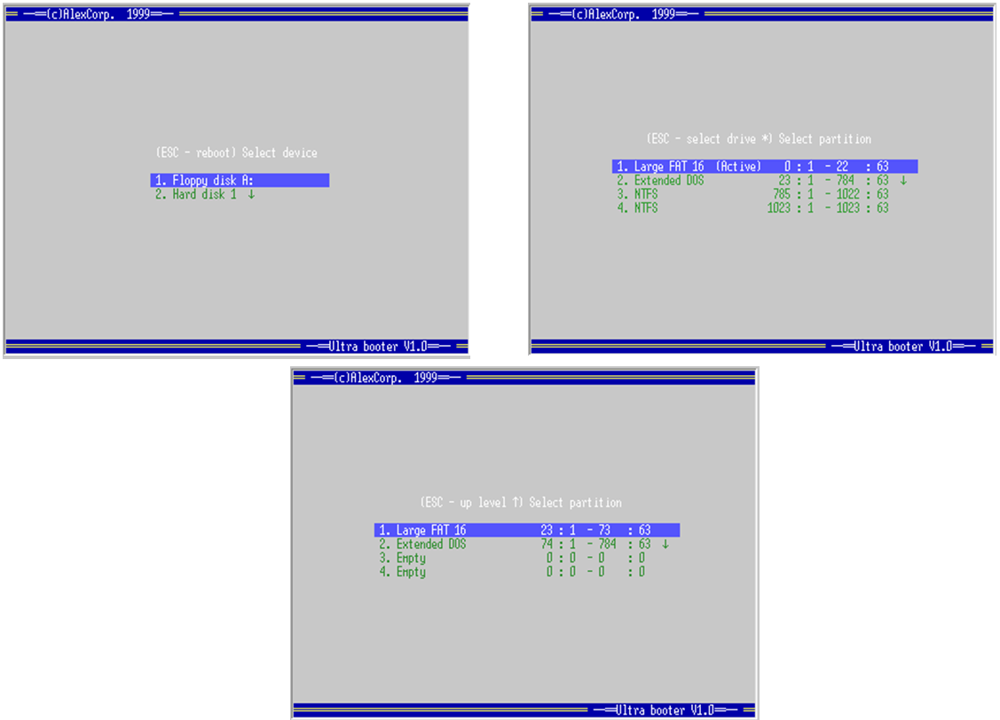

## Первичный загрузчик операционных систем

Представляет из себя загрузчик для boot-sector'а с возможностью выбора устройства и любого раздела для загрузки, а только активного раздела. При запуске отображает меню. Также, позволяет загружать MS DOS с дополнительного устройства, а не только с A:.
Разработано на Turbo Assembler и Borland C++ 3.1.

[Полная документация ](./gorin_l1_rep.doc).

**UI загрузчика**


### Сборка

1. Откомпилировать myldr.prj с опциями “compile via assembler”, “generate as-sembler sources”. В каталоге \EXE окажутся drvfunc.asm и gensel.asm.
1. Скопировать эти 2 asm файла в каталог \SecBoot.
1. Выполнить файл make.bat:

```bash
tasm /D__TINY__ /D__CDECL__ /ml /m3 /q /e     sload.asm + drvfunc.asm + gensel.asm   > m_asm
tlink /C /c /m /s /n     sload.obj  drvfunc.obj gensel.obj, mfunc, , cs.lib   > m_lnk
exe2bin mfunc.exe mfunc.bin
```
После получения файла mfunc.bin и перед компиляцией stsec.prj в файле detect.h нужно указать число секторов, которое для него требуется (#define FNAME_SBOOT_SECTORS 12).

## Инсталлятор

### Функции

Предназначен для:
* поиска подходящего (гарантирующего физическую непрерывность) места на диске для файла mfunc.bin и старого загрузочного сектора;
* размещения mfunc.bin на диске;
* сохранения старого загрузочного сектора;
* Размещения fboot.bin в загрузочном секторе;
* преобразования логического положения для конкретной ОС и файловой систе-мы этих файлов в физическое;
* запись физического местоположения в заголовке первичного загрузчика.

### Требования

Должен уметь перемещать файлы, читать и писать сектора дисков, преобразовывать логическое положение файла в физическое положение для конкретной ОС. Допускается ис-пользование любых средств.
В качестве примера был реализован инсталлятор для DOS. Для упрощения преобра-зования было решено размещать вторичный загрузчик и старый загрузочный сектор в конце дорожки 0, 0, 2 (сразу за MBR) для жёсткого диска и в инженерный цилиндр для гибкого (nMaxCyls + 1, 0, 1).
Другой вариант – разместить их в файловой системе как файлы с системным атрибу-том  (для фиксации), но тогда придётся гарантировать непрерывность и вычислить физиче-ское положение. Это трудоёмко. Была попытка вычислить физическое положение файла на основе номера начального кластера DOS, хранящегося в записи SFT для открытого файла:
```assembler
mov	ax, 1220h //GET JOB FILE TABLE ENTRY
mov	bx, hFile
int	2Fh

movzx	bx, byte ptr es:[di]
mov	ax, 1216h //GET ADDRESS OF SYSTEM FILE TABLE ENTRY
int	2Fh
```
Но не удалось найти описания формата SFT для MS DOS 7.10. Даже в этом случае вычисления были бы объёмными – нужно было определить раздел, где находится логиче-ский диск и просчитать его физическое положение.

### Местоположение на диске

Обычный файл. Для работы ещё требуются fboot.bin, mfunc.bin, находящиеся в одном каталоге с  stsec.exe.

### Технология реализации

<pre>\StorSec\:   detect.cpp, detect.h, dtypes.h, stsec.cpp.</pre>
Исполняемый файл в модели small. Утилита командной строки.
**Обращение:**
```bash
		stsec.com /s drive track sec head count_OF_sec "outFile"
Where:
		drive:  	0 - 3 OR 128 - 131
		track:  	0 - 1023
		sec:    	1 - 63
		head:   	0 - 255
```

**Example:**
```bash
		stsec.com /s 0x80 0 1 0 1 "e:\bsec.bin"

----- OR
		stsec.com /i patch_to_install

----- OR
		stsec.com /u patch_from_uninstall 
```

#### Алгоритм выбора физического положения вторичного загрузчика и старого загрузочного сектора

Как уже говорилось, для гибкого диска это инжинерный цилиндр, для жёсткого – остаток нулевой дорожки (0,0,1). Предварительно осуществляется проверка достаточного количества физических секторов в одном цилиндре диска. Требуется чило секторов доста-точное для NSectors(mfunc.bin) + 1 (для старого загрузочного сектора). Если их не хватает, то выдаётся сообщение о невозможности установки на этот диск. В случае жёсткого диска ещё нужно проверить поле lHidSects – число скрытых секторов. Это сектора, следующие за MBR и не принадлижащие ни одному разделу. При стандартном разбиении диска скрытой поме-чается вся нулевая дорожка, содержащая MBR, т.е. это число равно числу секторов на до-рожку. Первый раздел начинается с головки 1, а весь остаток нулевой дорожки (после секто-ра 1) свободен. Требуется, чтобы lHidSects – 1 было достаточно для  NSectors(mfunc.bin) + 1. В противном случае так же выдаётся сообщение о невозможности установки. Здесь проце-дура из файла Detect.cpp, реализующая это.

```cpp
int DetectPlacing( /*[in]*/char* pFilePatch, /*[content out]*/Placing* pPl )
//RETURN:
//	-1 - system error
//	-2 - too small track
//	 0 - OK
 {
   WORD wDOSDrv = toupper(pFilePatch[ 0 ]) - 'A';

   DPB far* pDPB = NULL;
//определить размер сектора
   asm {
      pushf
      push	ds

      mov	ah, 32h //получить Drive Parameter Block
      mov	dl, wDOSDrv
      inc	dl
      int	21h
      cmp	al, 0FFh
      jz	L_BPBErr_DetectPlacing

      mov	word ptr pDPB, bx
      mov	word ptr pDPB + 2, ds
    }
L_BPBErr_DetectPlacing:
   asm {
      pop	ds
      popf
   }

   if( !pDPB ) return -1;

   pPl->wSecSize = pDPB->wSectSize;

   WORD wNSecs, wBufSize;
   if( pPl->wSecSize == 256 )
     wNSecs = 2, wBufSize = 512;
   else
     wNSecs = 1, wBufSize = pPl->wSecSize;

   BYTE* pSector = (BYTE*)malloc( wBufSize );
   if( !pSector ) return -1;
   if( absread(wDOSDrv, wNSecs, 0, pSector) )
    {
      free( pSector );
      return -1;
    }

   BPB_ *p = (BPB_*)pSector;


//исправить код устройства для гибкого диска (так как в загрузочной записи гибкого диска всегда DrvNo=0)
   BYTE bTmp;
   if( p->bDrvNo == 0 && wDOSDrv !=0 )
     bTmp = pPl->wDrv = wDOSDrv;
   else
     bTmp = pPl->wDrv = p->bDrvNo;


   //DriveParams far* pDP;
   WORD wCS;

   asm {
      pushf
      push	es

      mov	ah, 8h	//получить параметры диска
      mov	dl, bTmp
      int	13h
      jc        L_ErrGetPD_DetectPlacing
      mov       wCS, cx	//max число секторов и цилиндров в формате Int13h
      jmp       L_OK_GetPD_DetectPlacing
   }
L_ErrGetPD_DetectPlacing:
    asm {
      mov       wCS, 0
    }

L_OK_GetPD_DetectPlacing:
    asm {
      pop	es
      popf
    }

   if( !wCS ) { free( pSector ); return -1; }

//в случае гибкого диска для размещения выбираем инжинерный цилиндр
//в случае жёсткого - свободное место на дорожке сразу за загрузочным сектором
//
   if( p->wSecPerTrk * p->wHeads < FNAME_SBOOT_SECTORS + 1 )
    {
      //не хватает одного цилиндра для размещения загрузчика и старого сектора
      //переход цилиндра для гибкого диска не обрабатываем
      free( pSector );
      return -2;
    }

   if( (pPl->bDeviceFlag = IsHDDorFloppy(pPl->wDrv)) == 0 )
    {
      pPl->wCyl = GET_TRACK(wCS) + 1;
      pPl->wSec = 1;
      pPl->wHead = 0;
    }
   else //HDD
    {
      if( p->lHidSects < FNAME_SBOOT_SECTORS + 2 )
       {
	  //число скрытых секторов при стандартном форматировании устанавливается для жёсткого диска
	 //в число секторов на дорожку, так как в 0,0,1 (где MBR) при этом
	 //резервируется вся дорожка, а раздел начинается с головки 1
	 //нам требуется, чтобы форматирование было стандартным
	 free( pSector );
	 return -2;
       }
      pPl->wCyl = 0;
      pPl->wSec = 2; //область сразу за MBR
      pPl->wHead = 0;
    }

   free( pSector );
   return 0;
 }
 ```

#### Реализация установки загрузчика

Первой всегда вызывается функция ParseParams, которая определяет режим работы, анализируя ключ (/s, /i, /u) и вызывает соответсвующий парсер параметров. После разбора параметров они выводятся для подтверждения. Перед этим (в ParseI) определяется физиче-ский номер устройства, которому принадлежит указанный в параметрах логический диск. Это делает DetectPlacing путём считывания загрузочной записи раздела через DOS Int25h (нулевой логический сектор DOS) и анализа поля DrvNo. Для гибких дисков оно всегда “0”, так как он может быть вставлен в разное устройство. В этом случае производится коррекция значения номера на правильное.
Помимо этого DetectPlacing возвращает ещё будущее место размещения старого за-грузочного сектора и вторичного загрузчика в физических параметрах.
Далее начинается установка:
* Проверка наличия нужных *.bin файлов;
* Считывание и сохранение старого загрузчика;
* Считывание вторичного загрузчика (mfunc.bin);
* Определение его длины;
* Запись вторичного загрузчика
* Снова считывание загрузочного сектора
* Считывание файла с первичным загрузчиком (fboot.bin)
* Модификация первичного загрузчика;
* Запись нового загрузочного сектора.

Модификация заключается в получении вместо исходного загрузочного сектора но-вого, с заменённым загрузчиком, но сохраннёной MBR и параметрами.
<pre>memcpy( cBufFB + 3, pBuf + 3, 59 );
memcpy( cBufFB + 0x1BE, pBuf + 0x1BE, 64 );</pre>
Ещё в заголовок загрузчика прописываются физические места положения вторичного загрузчика и старого загрузочного сектора.
